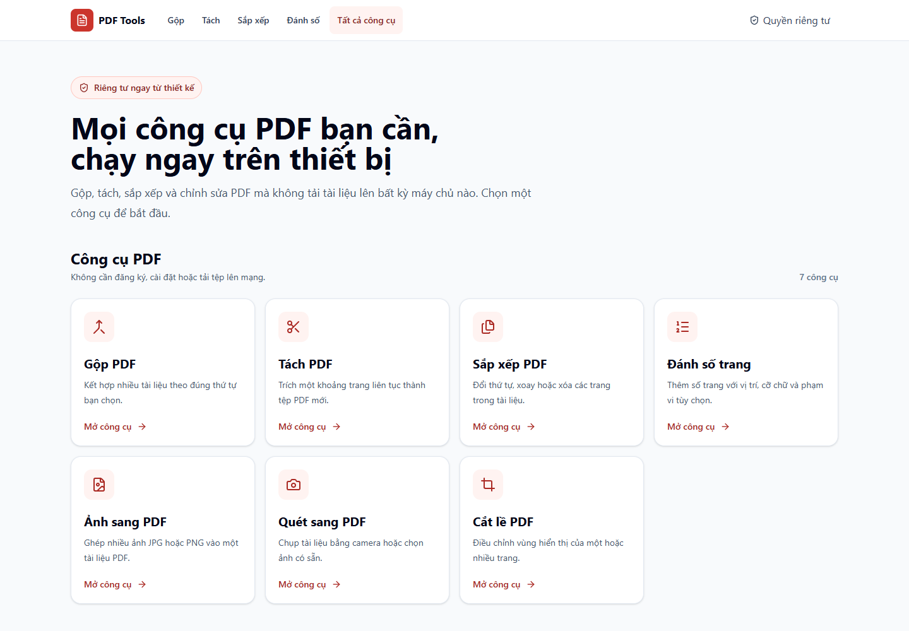

<div align="center">

# PDF Tools

**Xử lý PDF riêng tư, ngay trên thiết bị.**<br>
*Private PDF processing, right in your browser.*

[](https://github.com/KimHuu2486/Processing_PDF/actions/workflows/pages.yml)


[**Trải nghiệm ngay · Live Demo →**](https://kimhuu2486.github.io/Processing_PDF/)

Không upload · Không tài khoản · Không backend xử lý tài liệu<br>
*No uploads · No account · No document-processing backend*

</div>



## Tại sao chọn PDF Tools? / Why PDF Tools?

PDF Tools là một static web app tiếng Việt giúp bạn chỉnh sửa PDF ngay trong
trình duyệt. Tài liệu được xử lý client-side và không rời khỏi thiết bị.

*PDF Tools is a Vietnamese-first static web app for editing PDFs directly in
your browser. Documents are processed client-side and never leave your device.*

| | Tiếng Việt | English |
|---|---|---|
| **Riêng tư / Private** | Tài liệu chỉ tồn tại trong bộ nhớ của tab hiện tại. | Documents stay in the current tab's memory. |
| **Tức thì / Instant** | Mở công cụ và xử lý ngay, không cần đăng ký hoặc đăng nhập. | Start processing immediately—no sign-up or login. |
| **Dễ triển khai / Easy to host** | Chạy như một static web app, không cần server xử lý PDF. | Runs as a static web app with no PDF-processing server. |

## Công cụ / Tools

| Công cụ / Tool | Mô tả / Description |
|---|---|
| **Gộp PDF / Merge PDF** | Kết hợp nhiều tài liệu theo thứ tự đã chọn. / *Combine multiple documents in your chosen order.* |
| **Tách PDF / Split PDF** | Trích một khoảng trang liên tục thành file mới. / *Extract a continuous page range into a new file.* |
| **Sắp xếp PDF / Organize PDF** | Đổi thứ tự, xoay hoặc xóa trang. / *Reorder, rotate, or remove pages.* |
| **Đánh số trang / Page Numbers** | Chọn phạm vi, vị trí và cỡ chữ. / *Choose the range, position, and font size.* |
| **Ảnh sang PDF / Images to PDF** | Ghép và sắp xếp ảnh JPG hoặc PNG thành PDF. / *Arrange JPG or PNG images into a PDF.* |
| **Quét sang PDF / Scan to PDF** | Chụp bằng camera hoặc dùng ảnh có sẵn. / *Capture with a camera or use existing images.* |
| **Cắt lề PDF / Crop PDF** | Điều chỉnh vùng hiển thị của một hoặc nhiều trang. / *Adjust the visible area of one or more pages.* |

## Quyền riêng tư & bảo mật / Privacy & Security

- PDF và ảnh chỉ được đọc vào bộ nhớ của tab hiện tại.<br>
  *PDFs and images are read only into the current tab's memory.*
- Không có database, analytics, local storage hay API xử lý tài liệu.<br>
  *No database, analytics, local storage, or document-processing API is used.*
- Metadata EXIF/XMP/IPTC và comment của JPEG được loại bỏ trước khi nhúng; EXIF
  orientation vẫn được áp dụng để hiển thị đúng chiều.<br>
  *JPEG EXIF/XMP/IPTC metadata and comments are removed before embedding, while
  EXIF orientation is still applied.*

> [!WARNING]
> PDF Tools không phải PDF sanitizer. Tệp đầu vào và đầu ra vẫn phải được xem là
> nội dung không tin cậy.<br>
> *PDF Tools is not a PDF sanitizer. Treat both input and output files as
> untrusted content.*

## Quick Start

Yêu cầu / *Requirements*: **Node.js 24+**

```powershell
npm install
npm run dev
```

Vite sẽ in URL development server ra terminal.<br>
*Vite will print the development server URL in your terminal.*

### Kiểm tra chất lượng / Quality checks

```powershell
npm run typecheck
npm run lint
npm test
npm run build
npm run test:e2e
```

## Tech Stack

| Nhóm / Area | Công nghệ / Technologies |
|---|---|
| **UI** | React 19, TypeScript 5, Tailwind CSS 4 |
| **PDF** | pdf-lib, PDF.js |
| **Tooling** | Vite 8, Vitest 4, Playwright |
| **Architecture** | Static web app, Web Worker |

## Triển khai GitHub Pages / GitHub Pages Deployment

1. Tạo public repository và push mã nguồn lên nhánh `main`.<br>
   *Create a public repository and push the source to `main`.*
2. Trong **Settings → Pages → Build and deployment**, chọn **GitHub Actions**.<br>
   *Under **Settings → Pages → Build and deployment**, select **GitHub
   Actions**.*
3. Workflow sẽ kiểm tra, build và publish thư mục `dist`.<br>
   *The workflow verifies, builds, and publishes the `dist` directory.*
4. Mở URL `https://<github-username>.github.io/<repository-name>/`.<br>
   *Open `https://<github-username>.github.io/<repository-name>/`.*

Workflow dùng tên repository làm base path khi build, vì vậy assets và PDF
Worker vẫn hoạt động nếu repository có tên khác.<br>
*The workflow uses the repository name as the build base path, so assets and
the PDF Worker continue to work under a different repository name.*

## Giới hạn & lưu ý an toàn / Limitations & Safety

> [!IMPORTANT]
> Crop chỉ thay đổi vùng hiển thị (`CropBox`), không xóa dữ liệu ẩn và không phù
> hợp để che thông tin nhạy cảm.<br>
> *Cropping changes only the visible area (`CropBox`); it does not remove hidden
> data and must not be used for redaction.*

> [!NOTE]
> PDF có mật khẩu, PDF hỏng, OCR, nén file và chuyển đổi Office chưa được hỗ trợ.
> Bookmark, form, attachment, metadata nâng cao và chữ ký số không được cam kết
> bảo toàn khi chỉnh sửa. Khả năng xử lý file lớn phụ thuộc vào RAM của thiết bị.
> Ảnh có độ phân giải cực lớn hoặc PDF có kích thước trang bất thường vẫn có thể
> làm tab hết bộ nhớ dù file nén nhỏ.<br>
> *Password-protected or damaged PDFs, OCR, compression, and Office conversion
> are not supported. Bookmarks, forms, attachments, advanced metadata, and
> digital signatures are not guaranteed to survive editing. Large-file capacity
> depends on the device's available memory. Extremely high-resolution images or
> PDFs with abnormal page dimensions can exhaust the tab's memory even when the
> compressed file is small.*
